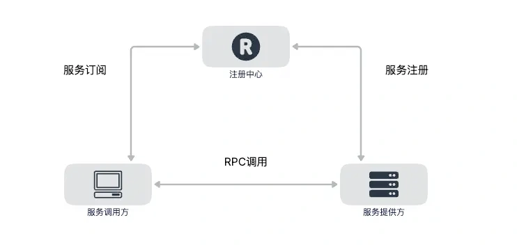
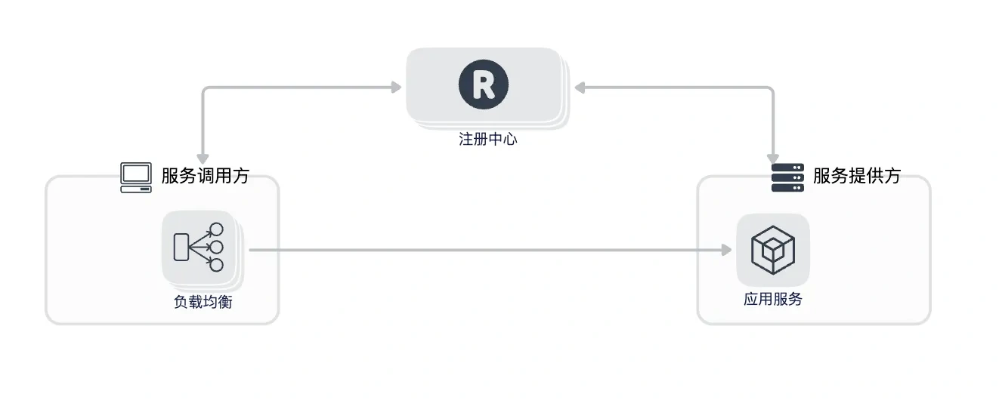
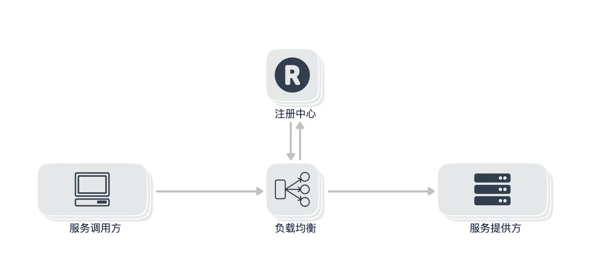
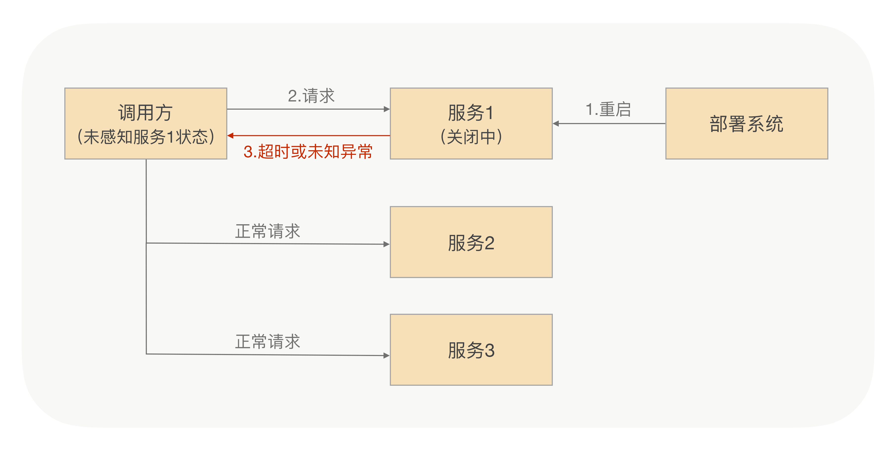
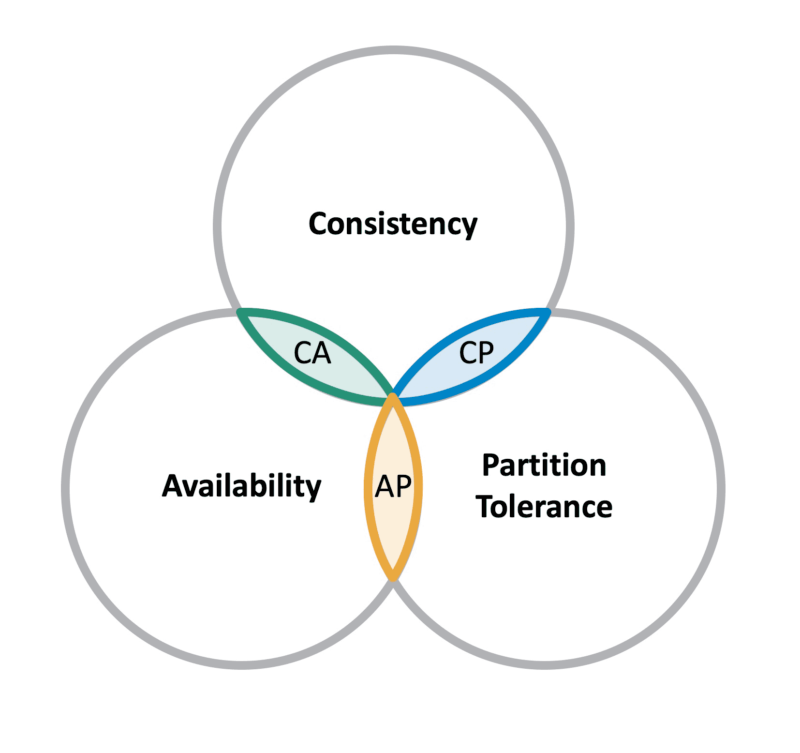

# service-discovery

用 Go 编写的服务发现组件，底层接入 etcd、consul、zookeeper 等中间件，实现了服务注册、发现、健康检查、负载均衡、服务预热等功能。

## 功能
服务发现整体架构

### 负载均衡
#### 客户端负载均衡
客户端向注册中心请求，获取服务所有的 endpoint，然后根据负载均衡策略选择一个endpoint，并调用之。

优点
- 没有单点造成的性能瓶颈、单点故障问题

缺点
- 无法管控客户端的负载均衡策略，不便于负载均衡策略的变更管理

#### 注册中心负载均衡
客户端向注册中心请求所有的 endpoints ，注册中心根据负载均衡算法在服务的 endpoint 中挑一个返回给客户端。

优点
- 能收口管理负载均衡算法，避免服务整体上的负载不均衡。

缺点
- 存在单点故障、性能瓶颈的问题
- 每次调用服务，都要去注册中心获取 endpoint，增加了网络开销

### endpoint 信息同步
在客户端负载均衡模式下，客户端侧保存有服务的所有 endpoint 信息，当服务的 endpoint 发生变化时，客户端需要及时更新 endpoint 信息，以保证能够调用到最新的 endpoint。

而 endpoint 的更新同步，有以下三种方式：
1. 注册中心主动推送
2. 客户端主动拉取
3. 推拉结合

### 优雅关闭
服务关闭时，会将自己从注册中心中删除，避免客户端请求到已经关闭的服务。但信息从服务端同步到注册中心，再同步到客户端，是一个异步的过程，所以在服务关闭时，可能会有一段时间的请求到已经关闭的服务。

因此，服务关闭时，会先通知注册中心，然后处理 inflight 的请求，处理完毕并且一段时间内无请求到来，才会真正地关闭服务。

### 启动预热
由于 Java 虚拟机需要预热、缓存需要加载才能达到最佳性能，所以刚启动的服务性能通常会比较差。
为避免这个问题，在服务刚启动时降低其负载均衡的权重，处理少量请求。待一段时候后再恢复其处理的请求数量。

### 健康检查
健康检查能帮助从 endpoint 列表中过滤掉有问题的节点，避免客户端请求到不可用的节点

有三种探活方式
1. 注册中心主动探活
2. 客户端心跳
3. 推拉结合

### 一致性取舍
在分布式系统中，Consistency(一致性)、Availability(可用性)、Partition Tolerance(分区容错性)，不能同时成立。
而注册中心通常是分布式的，所以需要做出取舍。

#### CP
保证数据的强一致性，但牺牲了高可用性。
例如基于 Etcd、ZooKeeper 的服务发现采用的是 CP 模型。

#### AP
在牺牲数据一致性的情况下最大程度保障服务的可用性。
例如基于 Eureka 的服务发现采用的是 AP 模型。

通常而言，服务发现的场景下，一致性要求不高，大部分选择 AP 模型。

### 路由配置
支持根据 tags 等信息自动配置、手动制定等方案，实现以下功能
- 分组调用
- 蓝绿发布
- 灰度发布
- 流量切换
- 线下测试联调

### 服务注册
注册中心探活，主动注册服务

服务主动向注册中心上报

